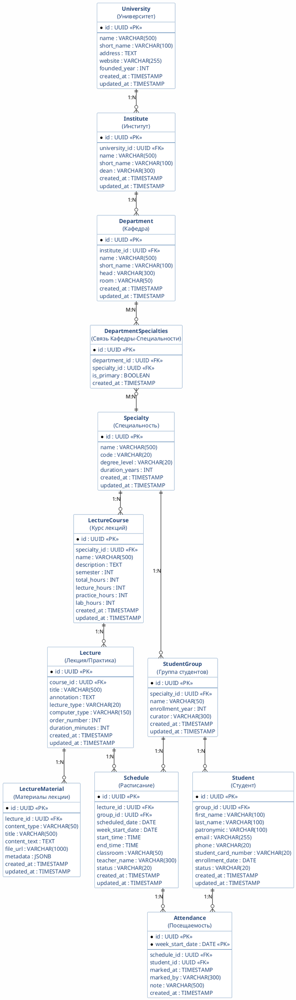

```plantuml

@startuml
' Стиль диаграммы
hide circle
hide empty methods
skinparam linetype ortho
skinparam backgroundColor #FEFEFE
skinparam class {
    BackgroundColor White
    BorderColor #3A6EA5
    FontColor #0A192F
    AttributeFontColor #2A4B7C
}

' === Сущности ===
entity "**University**\n(Университет)" as University {
    *id : UUID <<PK>>
    --
    name : VARCHAR(500)
    short_name : VARCHAR(100)
    address : TEXT
    website : VARCHAR(255)
    founded_year : INT
    created_at : TIMESTAMP
    updated_at : TIMESTAMP
}

entity "**Institute**\n(Институт)" as Institute {
    *id : UUID <<PK>>
    --
    university_id : UUID <<FK>>
    name : VARCHAR(500)
    short_name : VARCHAR(100)
    dean : VARCHAR(300)
    created_at : TIMESTAMP
    updated_at : TIMESTAMP
}

entity "**Department**\n(Кафедра)" as Department {
    *id : UUID <<PK>>
    --
    institute_id : UUID <<FK>>
    name : VARCHAR(500)
    short_name : VARCHAR(100)
    head : VARCHAR(300)
    room : VARCHAR(50)
    created_at : TIMESTAMP
    updated_at : TIMESTAMP
}

entity "**Specialty**\n(Специальность)" as Specialty {
    *id : UUID <<PK>>
    --
    name : VARCHAR(500)
    code : VARCHAR(20)
    degree_level : VARCHAR(20)
    duration_years : INT
    created_at : TIMESTAMP
    updated_at : TIMESTAMP
}

entity "**DepartmentSpecialties**\n(Связь Кафедры-Специальности)" as DeptSpec {
    *id : UUID <<PK>>
    --
    department_id : UUID <<FK>>
    specialty_id : UUID <<FK>>
    is_primary : BOOLEAN
    created_at : TIMESTAMP
}

entity "**LectureCourse**\n(Курс лекций)" as LectureCourse {
    *id : UUID <<PK>>
    --
    specialty_id : UUID <<FK>>
    name : VARCHAR(500)
    description : TEXT
    semester : INT
    total_hours : INT
    lecture_hours : INT
    practice_hours : INT
    lab_hours : INT
    created_at : TIMESTAMP
    updated_at : TIMESTAMP
}

entity "**Lecture**\n(Лекция/Практика)" as Lecture {
    *id : UUID <<PK>>
    --
    course_id : UUID <<FK>>
    title : VARCHAR(500)
    annotation : TEXT
    lecture_type : VARCHAR(20)
    computer_type : VARCHAR(150)
    order_number : INT
    duration_minutes : INT
    created_at : TIMESTAMP
    updated_at : TIMESTAMP
}

entity "**LectureMaterial**\n(Материалы лекции)" as LectureMaterial {
    *id : UUID <<PK>>
    --
    lecture_id : UUID <<FK>>
    content_type : VARCHAR(50)
    title : VARCHAR(500)
    content_text : TEXT
    file_url : VARCHAR(1000)
    metadata : JSONB
    created_at : TIMESTAMP
    updated_at : TIMESTAMP
}

entity "**StudentGroup**\n(Группа студентов)" as StudentGroup {
    *id : UUID <<PK>>
    --
    specialty_id : UUID <<FK>>
    name : VARCHAR(50)
    enrollment_year : INT
    curator : VARCHAR(300)
    created_at : TIMESTAMP
    updated_at : TIMESTAMP
}

entity "**Student**\n(Студент)" as Student {
    *id : UUID <<PK>>
    --
    group_id : UUID <<FK>>
    first_name : VARCHAR(100)
    last_name : VARCHAR(100)
    patronymic : VARCHAR(100)
    email : VARCHAR(255)
    phone : VARCHAR(20)
    student_card_number : VARCHAR(20)
    enrollment_date : DATE
    status : VARCHAR(20)
    created_at : TIMESTAMP
    updated_at : TIMESTAMP
}

entity "**Schedule**\n(Расписание)" as Schedule {
    *id : UUID <<PK>>
    --
    lecture_id : UUID <<FK>>
    group_id : UUID <<FK>>
    scheduled_date : DATE
    week_start_date : DATE
    start_time : TIME
    end_time : TIME
    classroom : VARCHAR(50)
    teacher_name : VARCHAR(300)
    status : VARCHAR(20)
    created_at : TIMESTAMP
    updated_at : TIMESTAMP
}

entity "**Attendance**\n(Посещаемость)" as Attendance {
    *id : UUID <<PK>>
    *week_start_date : DATE <<PK>> 
    --
    schedule_id : UUID <<FK>>
    student_id : UUID <<FK>>
    marked_at : TIMESTAMP
    marked_by : VARCHAR(300)
    note : VARCHAR(500)
    created_at : TIMESTAMP
}

' === Связи ===
University ||--o{ Institute : "1:N"
Institute ||--o{ Department : "1:N"

' Исправление 1: Правильная связь Department к Specialty через ассоциативную сущность
Department ||--o{ DeptSpec : "M:N"
DeptSpec }o--|| Specialty : "M:N"

' Исправление 2: Правильная связь 1:N между Specialty и LectureCourse
Specialty ||--o{ LectureCourse : "1:N"
LectureCourse ||--o{ Lecture : "1:N"
Lecture ||--o{ LectureMaterial : "1:N"

Specialty ||--o{ StudentGroup : "1:N"
StudentGroup ||--o{ Student : "1:N"

' Связь между расписанием, лекцией и группой (M:N через Schedule)
Lecture ||--o{ Schedule : "1:N"
StudentGroup ||--o{ Schedule : "1:N"

' Связь посещаемости (M:N через Attendance)
Schedule ||--o{ Attendance : "1:N"
Student ||--o{ Attendance : "1:N"

@enduml

```